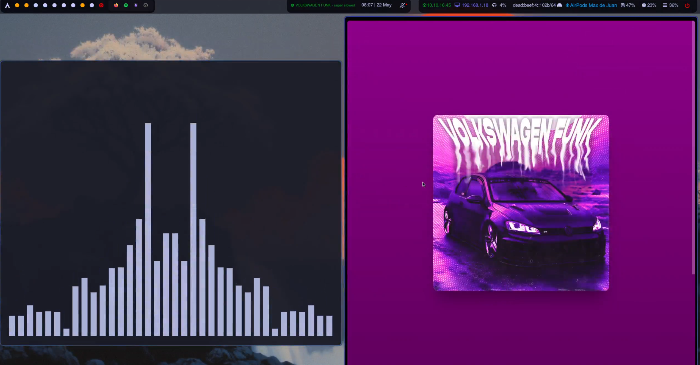

# Hyprland Arch Linux Dotfiles

**NOT COMPLETE YET**

These are the dotfiles for my personal Arch Linux "rice," configured with the Hyprland compositor.

**Operating System:** Arch Linux

**Window Manager:** [Hyprland](https://hyprland.org/) 

**Bar:** [Waybar](https://github.com/Alexays/Waybar) 

**Notes App:** [Obsidian](https://obsidian.md/) 

**Launcher/Power Menu:** [Rofi](https://github.com/adi1090x/rofi) 

**Screen Locker:** [Hyprland Lock](https://wiki.hyprland.org/Utilities/Hyprlock/) 

**Text Editor:** [NvChad](https://nvchad.com/) 

**Terminal Emulator:** [Kitty](https://sw.kovidgoyal.net/kitty/) 

**Display Manager:** [SDDM](https://github.com/sddm/sddm) Theme: [sddm-astronaut-theme](https://github.com/Keyitdev/sddm-astronaut-theme)

**BlackArch repo:** https://blackarch.org/downloads.html

## Video 

https://youtu.be/lpfnx4CC9cw

## Screenshots

Here are some screenshots showcasing the rice:

